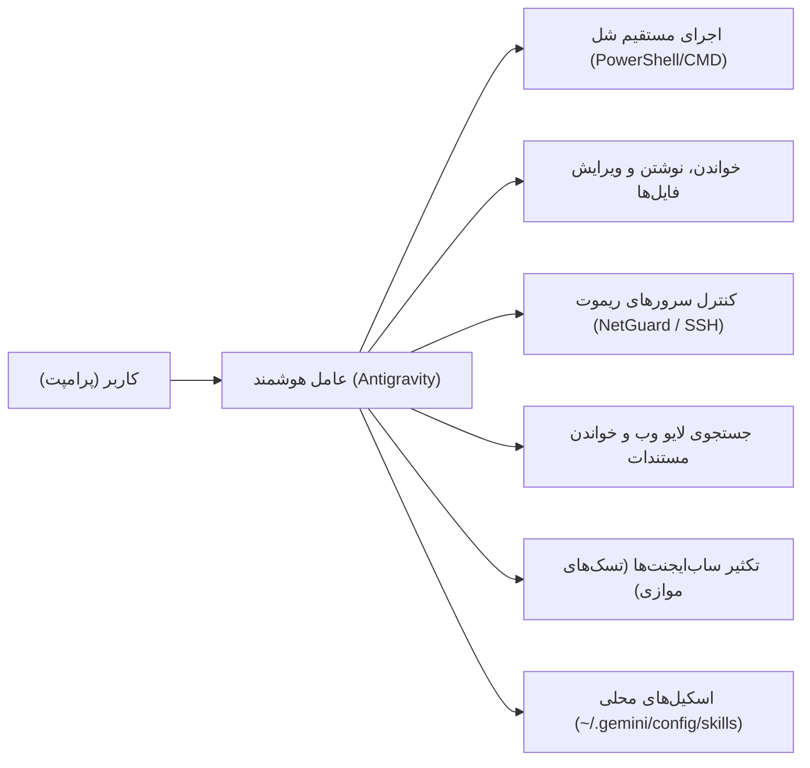

# 🚀 راهنمای جامع و مرجع عملیاتی کار با Antigravity و اسکیل‌های تخصصی

این راهنما یک مرجع کامل، کاربردی و فارسی برای استفاده حداکثری از قابلیت‌های عامل هوشمند **Antigravity** و اسکیل‌های تخصصی نصب‌شده روی سیستم شماست.

---

## فهرست مطالب

1. [آشنایی با ماهیت سیستم: تفاوت هوش مصنوعی عامل‌محور (Agentic AI) با چت‌بات معمولی](#۱-آشنایی-با-ماهیت-سیستم)
2. [کالبدشکافی اسکیل‌های فعال روی سیستم شما](#۲-کالبدشکافی-اسکیل‌های-فعال-روی-سیستم-شما)
   - [`reverse-skill`: مهندسی معکوس، کرک و امنیت](#-reverse-skill)
   - [`waterwall-expert`: معماری تونل‌های شبکه و ضد فیلترینگ](#-waterwall-expert)
   - [`deep-task-orchestrator`: ارکستراسیون تسک‌های پیچیده و مهندسی سیستم](#-deep-task-orchestrator)
   - [`frontier-deep-reasoning`: موتور تفکر عمیق و خلاقیت ساختارمند](#-frontier-deep-reasoning)
3. [نحوه فراخوانی و استفاده از اسکیل‌ها](#۳-نحوه-فراخوانی-و-استفاده-از-اسکیل‌ها)
   - [حالت ۱: خودکار و هوشمند (Progressive Disclosure)](#حالت-۱-خودکار-و-هوشمند-progressive-disclosure)
   - [حالت ۲: فراخوانی صریح با نشانه `@`](#حالت-۲-فراخوانی-صریح-با-نشانه-)
   - [نحوه اضافه کردن اسکیل‌های جدید در آینده](#نحوه-اضافه-کردن-اسکیل‌های-جدید-در-آینده)
4. [جعبه‌ابزار اسلش‌کامندها (Slash Commands) و نحوه استفاده](#۴-جعبه‌ابزار-اسلش‌کامندها-slash-commands)
5. [قابلیت‌ها و توانمندی‌های سیستمی هوش مصنوعی](#۵-قابلیت‌ها-و-توانمندی‌های-سیستمی-هوش-مصنوعی)
6. [سناریوهای عملی و پرامپت‌های آماده (Cheat Sheet)](#۶-سناریوهای-عملی-و-پرامپت‌های-آماده-cheat-sheet)
7. [قوانین طلایی برای گرفتن بهترین خروجی](#۷-قوانین-طلایی-برای-گرفتن-بهترین-خروجی)

---

## ۱. آشنایی با ماهیت سیستم

مدل‌های معمولی مثل ChatGPT یا Claude در وب، تنها متن تولید می‌کنند و به سیستم شما دسترسی ندارند. اما **Antigravity یک عامل خودمختار (Autonomous Coding Agent)** است:



> [!NOTE]
> دستیار کارهای شما را فرضی انجام نمی‌دهد؛ مستقیماً دستورات شل را می‌زند، کدها را می‌نویسد، پکیج‌ها را نصب می‌کند، خروجی را بررسی کرده و اگر خطایی باشد خودکار دیباگ می‌کند.

---

## ۲. کالبدشکافی اسکیل‌های فعال روی سیستم شما

اسکیل‌های شما در دایرکتوری سراسری سیستم در مسیر زیر ذخیره شده‌اند:
📁 `C:\Users\Joestar\.gemini\config\skills\`

### ۱. `reverse-skill`
* **مسیر**: [`C:\Users\Joestar\.gemini\config\skills\reverse-skill`](file:///C:/Users/Joestar/.gemini/config/skills/reverse-skill)
* **وظیفه**: جعبه‌ابزار جامع مهندسی معکوس، کرک، تحلیل بدافزار، کالبدشکافی اپ‌ها و چالش‌های امنیتی.
* **توانایی‌ها**:
  * **اندروید و موبایل**: دیکامپایل APK با `jadx` و `apktool`، دور زدن SSL Pinning و Root Detection با `Frida`، ادیت سورس Smali و ساین مجدد APK.
  * **باینری و ویندوز/لینوکس**: دیس‌اسمبل و دیکامپایل فایل‌های `.exe`, `.dll`, `.so` با `radare2`، ساختاردهی برای `IDA Pro` و `Ghidra`.
  * **جاوااسکریپت و وب**: رمزگشایی توابع هش و امضای فرانت‌اند (JS Reverse)، دی‌سورس‌مپ کردن وب‌پک، شبیه‌سازی ریکوئست‌ها در محیط Node.js.
  * **چالش‌های CTF و نفوذ**: حل مسائل Pwn، سرریز بافر، زنجیره‌های ROP، و تست آسیب‌پذیری‌های وب با ۲۰+ ابزار امنیتی.

### ۲. `waterwall-expert`
* **مسیر**: [`C:\Users\Joestar\.gemini\config\skills\waterwall-expert`](file:///C:/Users/Joestar/.gemini/config/skills/waterwall-expert)
* **وظیفه**: طراحی، کانفیگ، تیونینگ سطح کرنل و دیباگ تونل‌های عبور از فیلترینگ با فریم‌ورک فوق‌سریع C به نام **WaterWall**.
* **توانایی‌ها**:
  * تسلط بر ۷۴ نود پردازشی WaterWall (مانند `tcp_listener`, `reverse`, `reality`, `mux`, `crypto`, `kcp`).
  * پیاده‌سازی معماری ترافیک معکوس (Reverse Tunnel) مناسب شرایط اینترنت ملی ایران.
  * بهینه‌سازی سوکت در سطح هسته لینوکس (`splice: true` برای Zero-Copy)، تنظیم الگوریتم احتقان TCP BBR، و کلمپ کردن MTU در بازه ۱۴۰۰ تا ۱۴۲۰.
  * ساخت خودکار سرویس‌های دائم `systemd` و اسکریپت‌های تست پکت‌لاس و Latency.

### ۳. `deep-task-orchestrator`
* **مسیر**: [`C:\Users\Joestar\.gemini\config\skills\deep-task-orchestrator`](file:///C:/Users/Joestar/.gemini/config/skills/deep-task-orchestrator)
* **وظیفه**: سازماندهی و مدیریت تسک‌های بزرگ مهندسی، بازطراحی چندفایلی، ریفکتورهای پیچیده و تست‌های سخت‌گیرانه.
* **ویژگی**: پایبندی به اصل «سخت‌گیری دو مرحله‌ای» (Adversarial Review)؛ مانع از ارائه کدهای نصفه یا راه‌حل‌های سرهم‌بندی‌شده می‌شود.

### ۴. `frontier-deep-reasoning`
* **مسیر**: [`C:\Users\Joestar\.gemini\config\skills\frontier-deep-reasoning`](file:///C:/Users/Joestar/.gemini/config/skills/frontier-deep-reasoning)
* **وظیفه**: تزریق قدرت استدلال حداکثری (معماری شناختی Claude Fable 5.1 Max و GPT-6 Astra Max).
* **ویژگی**: تفکر از اصول اولیه (First Principles)، تحلیل چندزاویه‌ای مسائل، رد راه‌حل‌های پیش‌پاافتاده و حل عمیق گلوگاه‌های عملکردی و امنیتی.

---

## ۳. نحوه فراخوانی و استفاده از اسکیل‌ها

### حالت ۱: خودکار و هوشمند (Progressive Disclosure)
سیستم طوری مهندسی شده که نیازی نیست همیشه اسم اسکیل را بیاورید! هر زمان موضوعی مطرح شود که به یکی از اسکیل‌ها مربوط باشد، هوش مصنوعی خودکار آن را فراخوانی می‌کند:

* **مثال ۱ (فعال‌سازی خودکار reverse-skill)**:
  > *"این فایل crackme.exe رو با radare2 باز کن و ببین رمز درستش چیه."*
* **مثال ۲ (فعال‌سازی خودکار waterwall-expert)**:
  > *"بین سرور ایران و آلمان یک تونل ریورس با ریالیتی راه‌اندازی کن که روی همراه اول قطعی نداشته باشه."*

### حالت ۲: فراخوانی صریح با نشانه `@`
اگر می‌خواهید کنترل صددرصدی داشته باشید و دستیار را مقید کنید که دقیقاً چارچوب آن اسکیل را مو‌به‌مو پیاده کند، در پرامپت خود از `@` استفاده کنید:

```text
@reverse-skill این فایل test.apk رو برام آنالیز کن و توابع شبکه رو استخراج کن.
```
```text
@waterwall-expert کانفیگ سرور ایران و خارج رو با سوکت اسپلاسیگ و الگوریتم BBR برام جنریت کن.
```

### نحوه اضافه کردن اسکیل‌های جدید در آینده
برای اضافه کردن یک اسکیل جدید، کافیست یک پوشه در مسیر `C:\Users\Joestar\.gemini\config\skills/<name>/` بسازید و درون آن فایلی به نام `SKILL.md` با ساختار زیر قرار دهید:

```markdown
---
name: my-custom-skill
description: توضیح دقیق درباره اینکه این اسکیل چه کاری انجام می‌دهد و چه زمانی باید فعال شود.
---

# دستورالعمل‌ها و ورودی‌ها
...
```
سیستم به محض ذخیره فایل، آن را در سشن‌های بعدی کشف و فعال می‌کند.

---

## ۴. جعبه‌ابزار اسلش‌کامندها (Slash Commands)

اسلش‌کامندها حالت‌های اجرایی عامل را تغییر می‌دهند. می‌توانید آن‌ها را در چت تایپ کنید:

| دستور | کاربرد و کارکرد اصلی | چه زمانی استفاده کنیم؟ |
| :--- | :--- | :--- |
| **`/boost`** | **حداکثر قدرت تحلیل و تفکر استراتژیک.** فعال‌سازی استدلال چندلایه قبل از کدنویسی. | برای مسائل سخت، معماهای پیچیده، باگ‌های ناشناخته و معماری سیستم. |
| **`/goal`** | **تکمیل پایدار تا هدف نهایی (بدون توقف زودهنگام).** هوش مصنوعی تا تمام کارها و تست‌ها انجام نشود متوقف نمی‌شود. | برای تسک‌های صفر تا صد، پیاده‌سازی کامل پروژه‌ها و اتوماسیون کامل. |
| **`/grill-me`** | **مصاحبه و شفاف‌سازی تعاملی.** هوش مصنوعی با طرح سوالات چندگزینه‌ای گزینه‌ها و ترجیحات شما را می‌پرسد. | وقتی در دوراهی انتخاب معماری هستید (مثلاً انتخاب پروتکل یا انتخاب ابزار). |
| **`/plan`** | **تدوین نقشه راه بدون دستکاری سیستم.** یک برنامه قدم‌به‌قدم به همراه دیاگرام ارائه می‌دهد. | قبل از ایجاد تغییرات بزرگ روی سرورها یا سورس‌کدهای حیاتی. |
| **`/learn`** | **ذخیره ماندگار رفتارها و راه‌حل‌ها.** اگر نکته جدیدی به دستیار آموختید، آن را برای چت‌های آینده ذخیره می‌کند. | بعد از رفع موفق یک کانفیگ خاص یا یاد دادن سلیقه کدنویسی‌تان. |
| **`/teamwork-preview`** | **تیم چندعاملی (Multi-Agent).** تکثیر مأموران فرعی موازی برای تست، تحلیل کد و اسکن هم‌زمان. | پروژه‌های بسیار بزرگ که چند کار هم‌زمان نیاز دارند. |

---

## ۵. قابلیت‌ها و توانمندی‌های سیستمی هوش مصنوعی

عامل شما به مجموعه‌ای از ابزارهای بومی مجهز است که به آن قدرت عمل واقعی می‌دهد:

1. **مدیریت کامل سیستم محلی (PowerShell / Windows CMD)**:
   * ساخت دایرکتوری، دانلود فایل، اجرای اسکریپت‌های پایتون و ابزارهای خط فرمان.
2. **مدیریت ریموت سرورها با `net_guard.py`**:
   * اتصال ریشه (`root@ip`) به سرورهای ایران و آلمان بدون افتادن پسورد و کلید در تاریخچه.
   * اجرای دستورات سنگین داخل نشست‌های پایدار `tmux` برای جلوگیری از قطع ارتباط اینترنتی.
3. **جستجوی وب و اعتبارسنجی بلادرنگ (Live Ground Truth Invariant)**:
   * دستیار هیچ وضعیتی را از روی حدس فرض نمی‌کند؛ همیشه پورت‌ها (`ss -tulpn`)، سرویس‌ها (`systemctl status`) و فایل‌ها را زنده می‌خواند.
4. **تکثیر ساب‌ایجنت‌ها (`invoke_subagent`)**:
   * تقسیم تسک‌های پیچیده به چند عامل فرعی در پس‌زمینه بدون کند کردن چت اصلی.

---

## ۶. سناریوهای عملی و پرامپت‌های آماده (Cheat Sheet)

### سناریوی ۱: آنالیز اپلیکیشن اندروید و دور زدن پینینگ
```text
@reverse-skill
این فایل app.apk رو با jadx دیکامپایل کن. 
می‌خوام آدرس اندپوئینت‌های API رو دربیاری و یه اسکریپت Frida برای دور زدن SSL Pinning بنویسی.
/boost /goal
```

### سناریوی ۲: راه‌اندازی تونل WaterWall بدون قطعی
```text
@waterwall-expert
روی سرور آلمان و ایران یک تونل معکوس Reality با استفاده از هسته WaterWall راه بنداز.
تنظیمات سوکت اسپلاسینگ صفر کپی فعال باشه و پکت لاس تا ۴۰٪ رو با FEC مهار کنه.
/boost /goal
```

### سناریوی ۳: حل معما یا اکسپلویت باینری (CTF/Pwn)
```text
@reverse-skill
فایل binary_challenge رو با radare2 آنالیز کن، طول بافر آسیب‌پذیر رو پیدا کن و یه اسکریپت pwntools برای اکسپلویت بنویس.
/boost
```

### سناریوی ۴: صفر تا صد یک پروژه کامل (Genesis Protocol)
```text
یک API فست‌پایتون کامل برای مدیریت لاگ‌های شبکه با دیتابیس SQLite بساز.
کامل کامل بنویس، هیچ placeholder یا کامنت فرضی نذار، تست بنویس و اجراش کن.
/goal /boost
```

---

## ۷. قوانین طلایی برای گرفتن بهترین خروجی

1. **ترکیب جادویی دستورات**: ترکیب `/boost /goal` به هوش مصنوعی می‌گوید عمیق‌ترین استدلال را به کار بگیرد و تا وقتی پروژه صددرصد تست و آماده نشده دست از کار نکشد.
2. **ارائه فایل و مسیر صریح**: همیشه مسیر فایل‌ها را صریح به دستیار بدهید (مثلاً `C:\Users\Joestar\Downloads\app.apk`).
3. **از `/grill-me` نترسید**: اگر مطمئن نیستید چه معماری به درد شما می‌خورد، بنویسید `/grill-me` تا هوش مصنوعی سوالات کلیدی را بپرسد و بهترین گزینه را پیشنهاد دهد.
4. **ثبت خطاهای جدید با `/learn`**: هر زمان مشکلی با روش خاصی حل شد، بگویید با `/learn` آن را به حافظه بسپارد تا دیگر آن اشتباه را تکرار نکند.

---
*تهیه‌شده توسط Antigravity برای Joestar — تاریخ نگارش: سپتامبر ۲۰۲۶*
