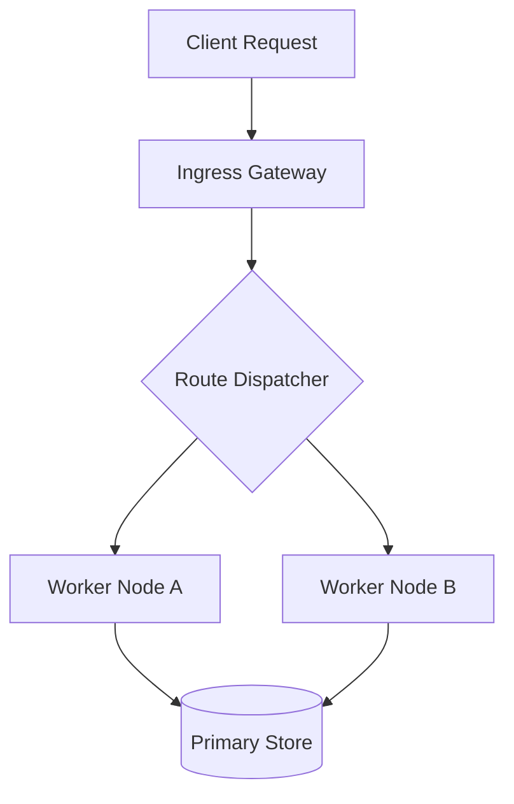

# System Architecture and High-Performance Components

This document serves as a comprehensive benchmark fixture for CommonMark, GitHub Flavored Markdown (GFM), math rendering, task lists, and diagram visualization.

---

## 1. Core Principles

High-throughput systems require predictable memory allocations and non-blocking I/O operations.

- Zero dynamic allocations on hot path
- Asynchronous task processing
- Thread affinity for latency-critical workers
- Deterministic resource cleanup via RAII

### Verification Checklist

- [x] Implement core state machine
- [x] Add zero-copy buffer parser
- [ ] Optimize lock-free queue concurrency
- [ ] Verify ARM64 memory ordering

---

## 2. Code Execution and Syntax Highlighting

Below is a minimal thread-safe worker queue implementation in modern C++:

```cpp
#include <iostream>
#include <queue>
#include <mutex>
#include <condition_variable>

template<typename T>
class ThreadSafeQueue {
private:
    mutable std::mutex m_mutex;
    std::queue<T> m_queue;
    std::condition_variable m_cv;

public:
    void push(T value) {
        std::lock_guard<std::mutex> lock(m_mutex);
        m_queue.push(std::move(value));
        m_cv.notify_one();
    }

    bool pop(T& value) {
        std::unique_lock<std::mutex> lock(m_mutex);
        m_cv.wait(lock, [this] { return !m_queue.empty(); });
        value = std::move(m_queue.front());
        m_queue.pop();
        return true;
    }
};
```

Python scripting automation:

```python
import sys
import time

def process_stream(batch_size: int = 100):
    print(f"Processing stream with batch size {batch_size}")
    return True

if __name__ == "__main__":
    process_stream()
```

---

## 3. Data Pipeline and Flow



---

## 4. Mathematics and Complex Analysis

The discrete Fourier transform (DFT) is given by:

$$X_k = \sum_{n=0}^{N-1} x_n \cdot e^{-\frac{i 2\pi}{N} k n}$$

With Euclidean distance defined as $d = \sqrt{(x_2 - x_1)^2 + (y_2 - y_1)^2}$.

---

## 5. Performance Metrics

| Benchmark Suite | Latency p50 (μs) | Latency p99 (μs) | Throughput (kops/s) |
| :--- | :---: | :---: | :---: |
| Memory Allocator | 12 | 45 | 1,420 |
| Queue Dispatch | 8 | 28 | 2,150 |
| JSON Serialization | 95 | 210 | 480 |
| Network Loop | 150 | 420 | 290 |
